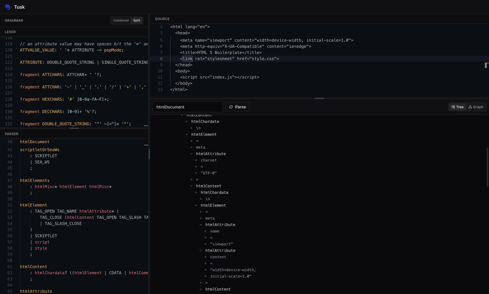

<p align="center">
  
</p>
<h1 align="center">Tusk</h1>
<p align="center">Tusk is a live ANTLR playground for authoring grammars, running parses, and inspecting parse trees as you type.</p>



## Features

- Live parsing with immediate errors and rule lists.
- Tree view and graph view for parse visualization.
- Searchable rule selection for large grammars.
- Combined grammar or split lexer/parser support.
- Modern, responsive UI with resizable panels.

## Tech Stack

- Frontend: React + Vite + TypeScript + Tailwind + React Flow.
- Backend: Flask + ANTLR4 (Python target) via the ANTLR tool JAR.

## Requirements

- Node.js 18+ (frontend)
- Python 3.10+ (backend)
- Java 11+ (ANTLR tool)

## Quick Start (Local)

### 1) API

```bash
cd api
python -m venv .venv
source .venv/bin/activate
pip install -r requirements.txt
gunicorn index:app --bind 0.0.0.0:5000
```

Make sure the ANTLR tool JAR is available at `api/vendor/antlr-4.13.2-complete.jar`.

### 2) Web

```bash
cd web
npm install
npm run dev
```

Set the API URL in `web/.env`:

```bash
VITE_API_URL=http://localhost:5000
```

## Tests

```bash
cd api
python -m venv .venv
source .venv/bin/activate
pip install -r requirements-dev.txt
pytest
```

## Docker (Optional)

```bash
docker compose up --build
```

The default compose file builds the frontend with a production API URL and exposes:
- Web: http://localhost:14750
- API: http://localhost:14751

## Using Split Lexer/Parser

Switch to "Split" in the grammar panel and provide:
- `lexer grammar` in the Lexer editor
- `parser grammar` in the Parser editor

Make sure your parser grammar references the lexer via `options { tokenVocab=YourLexerGrammar; }`.

## API

### POST `/parse`

Request body (combined grammar):

```json
{
  "grammar": "grammar Expr; ...",
  "source": "1 + 2",
  "rule": "expr"
}
```

Request body (split grammar):

```json
{
  "lexer": "lexer grammar ExprLexer; ...",
  "parser": "parser grammar ExprParser; ...",
  "source": "1 + 2",
  "rule": "expr"
}
```

Response:

```json
{
  "grammar_name": "Expr",
  "errors": [],
  "rules": ["expr", "term"],
  "string_tree": "(expr ...)"
}
```

## Notes

- The API runs ANTLR at request time to generate lexer/parser files in a temp directory.
- Errors from ANTLR are returned in `errors` with a `400` response.

## License

MIT
